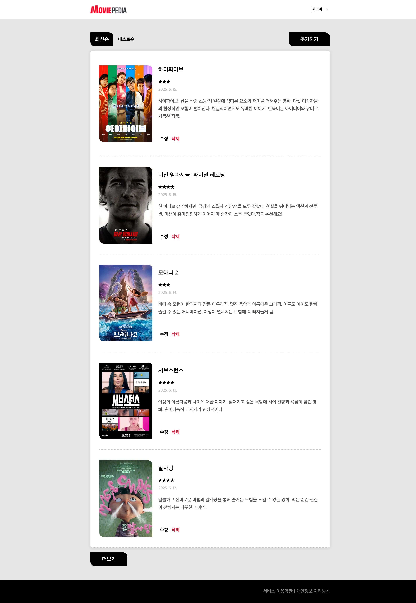
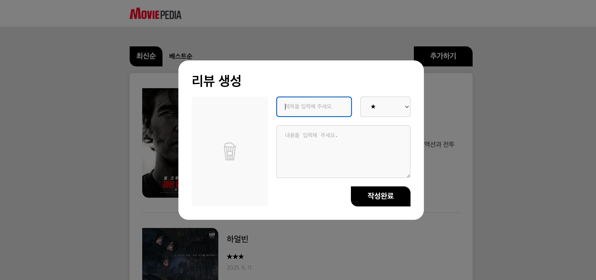

# 🎬 Moviepedia | 영화 리뷰 사이트

> React 개발 기초 강의를 통해  
> 컴포넌트 구조와 Hooks(useState, useEffect, useRef)를 활용하고,  
> 배열 데이터를 map()으로 렌더링하며  
> createPortal 기반 모달 UI를 구현한 영화 리뷰 사이트입니다.

**배포 링크 (Netlify)**  
https://moviepedia-kujihye.netlify.app

---

## 주요 기능

- 배열 데이터를 `map()`으로 렌더링한 영화 리뷰 목록
- 상태(state)에 따라 전환되는 최신순 / 베스트순 탭
- 리뷰 추가 / 수정 / 삭제
- `createPortal`을 활용한 모달 기반 리뷰 작성 UI
- `Context`를 활용한 전역 상태 관리
- 다국어 지원
- 외부 API 데이터 연동
- Offset 기반 페이지네이션
- 이미지 업로드 시 미리보기
- 더보기 및 리뷰 작성에 로딩 / 에러 처리
  - `useActionState`를 활용한 비동기 상태 관리
  - `useCallback`을 통한 불필요한 리렌더링 방지

---

## 사용 기술

- React
- JavaScript (ES6+)
- HTML / CSS
